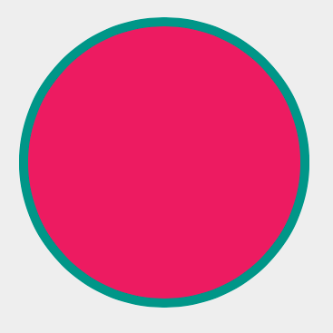
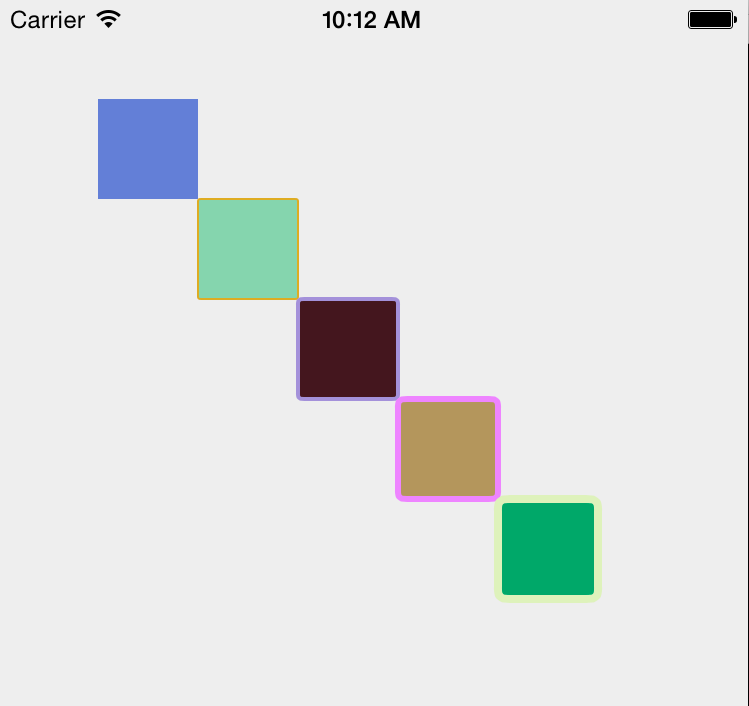
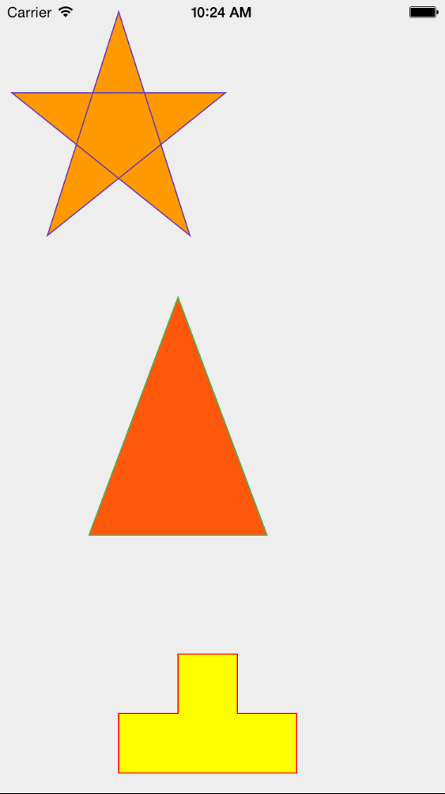
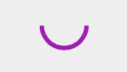

#Artisan

Artisan is a graphics library for iOS inspired by [Raphael](http://raphaeljs.com) and [SVG](http://www.w3.org/TR/SVG/Overview.html). It uses [CoreGraphics](https://developer.apple.com/library/prerelease/ios/documentation/CoreGraphics/Reference/CoreGraphics_Framework/index.html) to draw shapes and paths but exposes a simpler Swift API.

##Setup
Start by adding Artisan.swift to your Xcode project.

##Create a drawing canvas
When we draw with Artisan, we do so onto a canvas. This canvas, which we'll reference in a variable called 'paper', is created using the Paper class. We always specify the width and height of the canvas. Optionaly, you can set the background color using the *fill* property. Colors are all defined using CSS hex style strings.
e.g.

    override func viewDidAppear(animated: Bool) {
        // setup a Paper object
        var paper: Paper = Paper(frame: self.view.bounds)
        paper.fill = "#eee"
        self.view.addSubview(paper)
	}
##Built in shapes
Now that we have the paper object we can add shapes to it. Coordinates follow the normal iOS convention with (0, 0) being at the top left. Other x, y points are relative to that point on the paper.

###Circles
To draw a **circle** use the circle function of the Paper class.

        var circle = paper.circle(xCenter: 150, yCenter: 300, r: 155)
        circle.fill = "#E91E63"
        circle.stroke = "#009688"
        circle.lineWidth = 5.0

Results in this

We can draw as many circles as we like and we don't have to reference them in a variable:

	paper.circle(xCenter: 200, yCenter: 100, r: 25)

###Ellipses	
**Ellipses** are drawn in a similar way using the Paper.ellipse function.

	paper.ellipse(xCenter: 150, yCenter: 150, width: 200, height: 20)
	
Its parameters are the same as the circle, i.e. xCenter, yCenter, except that we can specify width and height radii separately.

###Rectangles
Other shapes we can draw include **rectangles**. We can draw a rectangle with the Paper.rect function

        var offset: Double = 50;
        for(var i = 0; i < 5; i+=1) {
            var rect = paper.rect(xOrigin: offset, yOrigin: offset, width: 50, height: 50, cornerRadius: Double(i))
            rect.fill = randomColorString()
            rect.lineWidth = CGFloat(i)
            rect.stroke = randomColorString()
            offset = offset + 50
        }
results in

Note how the linewidth and corner radius are also set.

##Paths
Use the Paper.path method to add paths to the paper. Paths are created using *path strings*. These loosely follow [SVG path](http://www.w3.org/TR/SVG/paths.html#PathData) strings, but are space delimited. i.e each command or data value must have a space between them in the string.

		// a block shape
        var tetronimo1 = paper.path("M 250 650 l 0 -50 l -50 0 l 0 -50 l -50 0 l 0 50 l -50 0 l 0 50 z")
        tetronimo1.stroke = "#f00"
        tetronimo1.fill = "#ff0"

        // Add a star shape
        var star = paper.path("M 100 10 L 40 198 L 190 78 L 10 78 L 160 198 z")
        star.stroke = "#673AB7"
        star.fill = "#FF9800"

        var triangle = paper.path("M 150 250 l -75 200 l 150 0 Z")
        triangle.stroke = "#4CAF50"
        triangle.fill = "#FF5722"
        

##Arcs
We can draw arcs that are portions of a circle using the Paper.arc function 

or using the "a" path string and the Path.path function.

        var arc = paper.path("a 100 100 25 0 180 1")
        arc.stroke = "#9C27B0"
        arc.lineWidth = 5.0

Results in an arc from 0 to 180 degrees with the center of (100, 100) and a radius of 25. It is drawn counter-clockwise, i.e. from 0 to 180.

##Images
You can add images to the paper using the Paper.image function

        var image = UIImage(named: "photoHeader")
        paper.image(src: image!, xOrigin: 0, yOrigin: Double(paper.bounds.size.height) - 140, width: 320, height: 140)
        
##Animations
Many of the properties exposed by the Element sub-classes support implicit animation. Changing the value of an ellipse's fill, height, width, xCenter and yCenter will all be animated to the new values. Changing of the *instructionString* property of a Path object will result in the shape of the object animated from its current shape to the new one.

##Todo
Future plans include adding more support for 

* drawing of text
* Bezier paths
* gradients
* explicit animations
* touch/gesture handling
* API improvements to use consistent data types. e.g. consistent use CGFloat or Swift language types like Double?
* Suite of demo code like the Raphael demos
        
